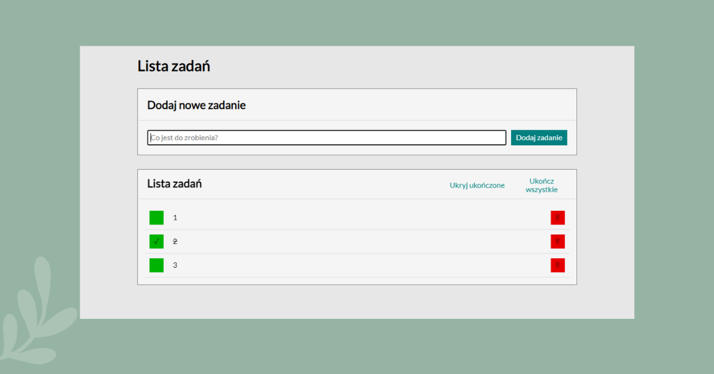

# Task list

## DEMO
Link: https://virusse7.github.io/todos-list-react/
## Description

In task list we can open another site with react-router to display details of task, also tasks can be marked as done or removed from list with buttons. If we want we can add example tasks to the list.

#### Used technologies: 
- ES6
- React.js
- React Router
- Redux
- Styled Components
- Flexbox
- Grid
- Fetch

This project was bootstrapped with [Create React App](https://github.com/facebook/create-react-app).

### Available Scripts

In the project directory, you can run:

### `npm start`

Runs the app in the development mode.\
Open [http://localhost:3000](http://localhost:3000) to view it in your browser.

The page will reload when you make changes.\
You may also see any lint errors in the console.

### `npm run build`

Builds the app for production to the `build` folder.\
It correctly bundles React in production mode and optimizes the build for the best performance.

The build is minified and the filenames include the hashes.\
Your app is ready to be deployed!

See the section about [deployment](https://facebook.github.io/create-react-app/docs/deployment) for more information.
